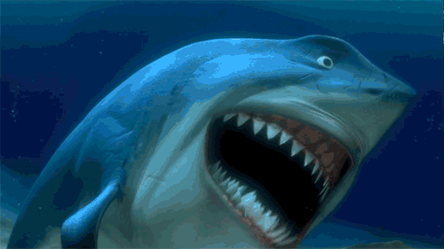

<!DOCTYPE html>
<html lang="en">
<head>
<meta charset="UTF-8" />
<meta name="viewport" content="width=device-width, initial-scale=1.0" />
<title>Pietra Miliare Maldives</title>

</head>

<body>
  <!-- Usa il tuo PNG originale; il bianco verrà “assorbito” dal fondo nero -->
  

  <h1>PIETRA MILIARE MALDIVES</h1>
  <canvas id="matrixCanvas"></canvas>

  <!-- GIF centrata e grande -->
  

<script>
const canvas = document.getElementById("matrixCanvas");
const ctx = canvas.getContext("2d");

let width = canvas.width = window.innerWidth;
let height = canvas.height = window.innerHeight;

const messages = [
  "until we make it",
  "zitto e nuota zitto e nuota nuota nuota",
  "一直到我们成功",
  "जब तक हम सफल न हों",
  "hasta que lo logremos",
  "حتى ننجح",
  "যতক্ষণ না আমরা সফল হচ্ছি",
  "até conseguirmos",
  "пока не добьемся этого",
  "成功するまで",
  "jusqu’à ce qu’on y arrive"
];

const fontSize = 20;
const textSpacing = fontSize + 5;
const lines = messages.length;
let offset = 0;

function dra
