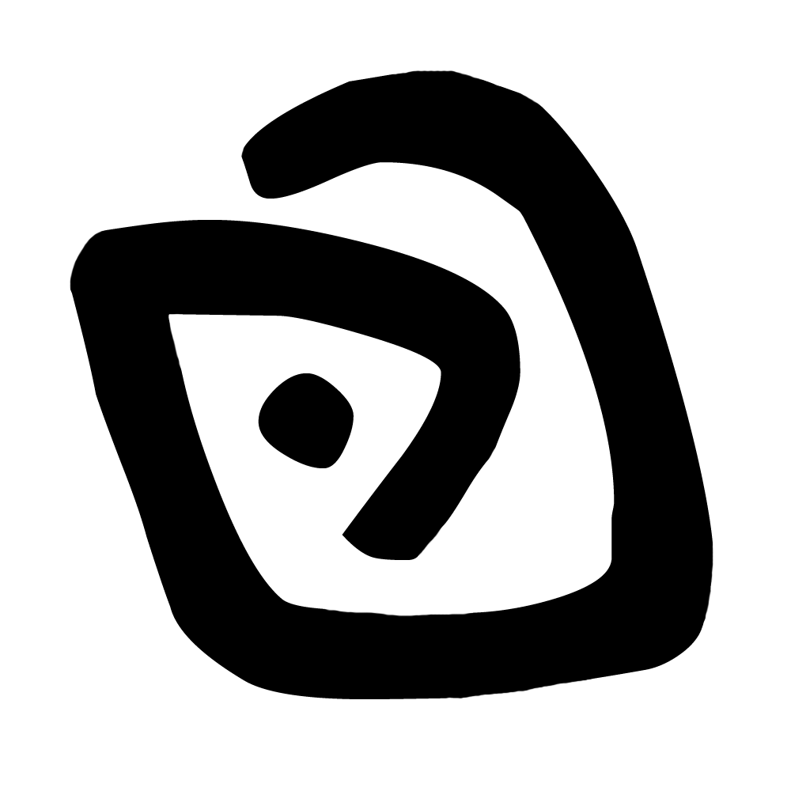

<html lang="en">
<head>
<meta charset="UTF-8" />
<meta name="viewport" content="width=device-width, initial-scale=1.0" />
<title>Pietra Miliare Maldives</title>

</head>

<body>

<h1>PIETRA MILIARE MALDIVES</h1>
<canvas id="matrixCanvas"></canvas>

</body>
</html>

